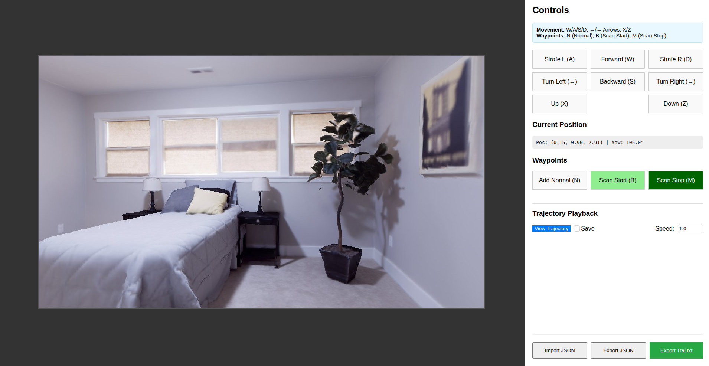

# HabitatExportTool 🚀

An interactive, web-based tool for creating and exporting camera trajectories in **Habitat-Sim**. This tool provides a simple UI to navigate within a 3D scene, define a camera path using waypoints, and export the complete trajectory as a sequence of RGB images, depth maps, and precise camera poses.

It is designed to simplify the data collection process for tasks like **Neural Radiance Fields (NeRF)**, **SLAM**, and other 3D reconstruction or robotics research projects.




---

## ✨ Features

*   **Interactive Web UI:** No need to write complex scripts for navigation. Control the camera directly from your browser.
*   **Real-time Rendering:** See the camera's viewpoint rendered in real-time as you navigate.
*   **Waypoint-based Trajectory Design:**
    *   Simply navigate to a desired location and add a waypoint with a single click or keypress.
    *   Supports different waypoint types (`Normal`, `Scan Start`, `Scan Stop`) to create complex camera motions like pans, orbits, and linear paths.
*   **Trajectory Preview:** Play back the generated trajectory within the UI to verify the camera path and speed before exporting.
*   **High-Quality Data Export:** When saving, the tool generates a complete dataset in a simple, structured format:
    *   RGB images (`.jpg`)
    *   16-bit depth maps (`.png`)
    *   A single `traj.txt` file with the 4x4 camera-to-world transformation matrix for every frame.
*   **Session Management:** Export and import your list of waypoints as a `.json` file to save and resume your work.

---

## 📂 Output Format

When you run a trajectory with the "Save" option enabled, the tool creates a `data/` directory with the following structure:

```
data/
├── traj.txt
├── results/
│   ├── frame000001.jpg
│   ├── depth000001.png
│   ├── frame000002.jpg
│   ├── depth000002.png
│   └── ...
```

*   `frameXXXXXX.jpg`: The RGB sensor output for the frame.
*   `depthXXXXXX.png`: A 16-bit single-channel PNG representing the depth map. The pixel values are scaled distance in meters. To convert back to meters, divide the pixel value by the `scale` factor defined in `app.py` (default is 6553.5).
*   `traj.txt`: A text file where each line corresponds to a frame and contains 16 space-separated values representing the flattened **4x4 camera-to-world transformation matrix**.

---

## 🔧 Setup

### Prerequisites

*   Python 3.8
*   A working installation of **Habitat-Sim**
*   A downloaded 3D scene file (e.g., from the Replica dataset)

### Installation

1.  **Clone the repository:**
    ```bash
    git clone https://github.com/eminsafa/HabitatExportTool.git
    cd HabitatExportTool
    ```

2.  **Create and Activate Conda Environment**
    ```shell
    conda env create -f environment.yml
    conda activate habitat-export
    ```

2.  **Install Python dependencies:**
    It is highly recommended to use a virtual environment.
    ```bash
    python -m venv venv
    source venv/bin/activate  # On Windows, use `venv\Scripts\activate`
    pip install -r requirements.txt # You should create this file with Flask, Pillow, numpy, etc.
    ```

3.  **Configure the Scene:**
    Open the `app.py` file and update the `SCENE_FILE` variable to point to the location of your `.ply`, `.glb`, or other supported scene file.

    ```python
    # in app.py
    SCENE_FILE = "/path/to/your/scene.ply"
    ```

---

## 🎮 Usage

1.  **Start the Server:**
    Run the Flask application from your terminal:
    ```bash
    python app.py
    ```
    The server will start, and the simulator will be initialized. This may take a moment.

2.  **Open the Web Interface:**
    Open your web browser and navigate to `http://127.0.0.1:5000`.

3.  **Create a Trajectory:**
    *   **Navigate** the scene using the `W/A/S/D` keys, the arrow keys for turning, and `X`/`Z` for moving up/down. You can also use the on-screen buttons.
    *   **Add Waypoints** at key locations using the buttons or keyboard shortcuts:
        *   `N` - Add a **Normal** waypoint (for movement).
        *   `B` - Add a **Scan Start** waypoint (for starting a rotation/scan).
        *   `M` - Add a **Scan Stop** waypoint (for ending a rotation/scan).
    *   The trajectory is interpolated between the waypoints you set.

4.  **Preview and Export:**
    *   Adjust the playback **Speed** if desired.
    *   Click **"View Trajectory"** to preview the path.
    *   To save the data, tick the **"Save"** checkbox and then click **"View Trajectory"**.
    *   The browser will play the trajectory, and the server will save each frame's data to the `data/` directory.

5.  **Find Your Data:**
    Once the playback is complete, you will find the generated images and `traj.txt` in the `data` folder inside your project directory.

---

## License

This project is licensed under the MIT License.